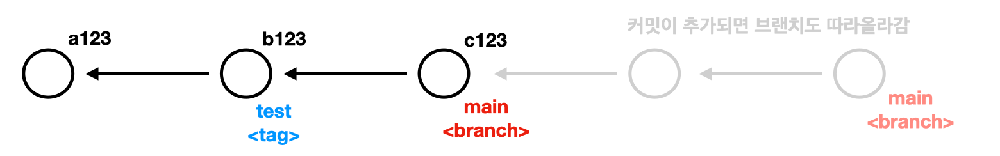

# Reference

## branch vs tag

- 공통정

  - 특정 커밋의 해시값을 기억하기 위한 사용
  - branch나 tag를 통해서 커밋을 옮겨다니면서 특정 시점의 파일 스냅샵으로 이동이 가능하다.(해당 커밋의 상태로 복원할 수 있다.)

- 차이점
  - tag : 하나의 커밋을 계속 바라보고 있다.(옮겨다니지 않는다.) 일부로 삭제하지않는 이상 계속 유지된다.
  - branch : 특정 브랜치에서 계속 작업을 하면(커밋이 계속 생성되면) 브랜치가 계속 따라서 옮겨다닌다.

## HEAD

- 현재 작업 중인 브랜치, 현재 프로젝트에서 바라보고 있는 브랜치를 가리키는 레퍼런스

- `.git/HEAD` 파일에 들어가면, `ref: refs/heads/master` 처럼 현재 HEAD가 바라보는 브랜치의 레퍼런스(파일 주소)가 나온다.

- `git reset --hard <태그 이름 | 커밋 해쉬값>`

  - 특정 커밋을 복원하는 명령어로 알고 있었다. 레퍼런스의 개념을 적용하여 좀 더 명확하게 말하면 HEAD가 바라보는 브랜치를 이동하는 명령어!

  - hard 옵션 의미 : 해당 해시값이 보고 있는 DB값을 불러와서 프로젝트 전체를 업데이트 시키다. hard 옵션이 없는 경우엔 그냥 브랜치만 이동한다.

  - 문제 상황 : reset hard 후에 되돌리기 전 의 커밋은 잃어버린걸까?

    1. `cat .git/logs/HEAD` 파일을 통해서 HEAD의 커밋 이동 순서를 확인할 수 있다.
    2. `git reflog` : 1번처럼 직접 파일을 확인하는 것보다 깃명령어를 통해서 HEAD의 변경 이력을 조회할 수 있다. ✅

## 각각의 레퍼런스가 저장되는 위치

- 브랜치

  - `.git/refs/heads` 안에 저장된다.
  - main 브랜치인 경우 `.git/refs/heads/main` main이라는 파일에 해당 브랜치의 해시값이 적혀있다.
  - feat/login 브랜치인 경우, `.git/refs/heads/feat/login` 으로서 마지막 login 파일에 해당 브랜치의 해시값이 기록되어 있다.

- 태그
  - `.git/refs/tags/test` test라는 파일로 저장되고 해당 태그의 커밋 해시값이 기록된다.
